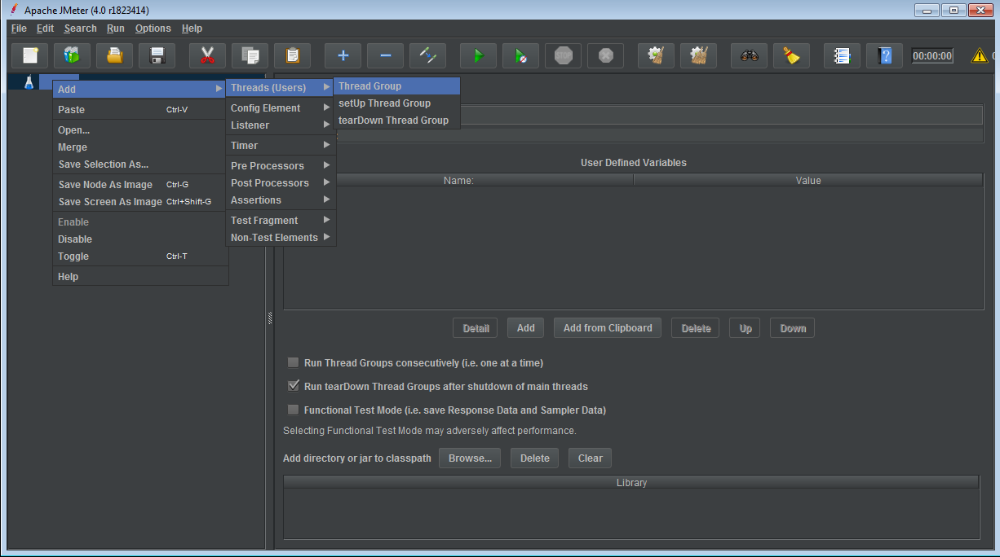

# Apache-JMeter

## Setup

### Step 1 - Start Jmeter

- jmeter.bat
- 

### Step 2 - Create a TestPlan

### Step 3 - Create a Thread Group (Users)

### Step 4 - Add a Sampler (Http)

- sampler is used to make the request. We create a HTTP sampler for http requests

### Step 5 - Add Listeners

Listeners are a way of seeing the data after the test is run or during

### Step 6 - To Run the Test

Run the test using the play button

### Clearing results

To clear results, click the broom in the bar

### Step 8 - Add certificate

## Using JMeter to Run Load Tests that Require Client Side Certificates

- JMeter supports client-side JKS and PKCS12 certificates ‘out-of-the-box’. It does this by using the SSL Manager to select the certificate when running in GUI mode. To use the PKCS12 certificate, make sure that the extension of the file is .p12 (e.g : mykeystore.p12). The other extension will be treated as a JKS (Java KeyStore) certificate.

- If you want to run your script using BlazeMeter (JMeter in non-GUI), take the following steps to allow your script to run with your client-side certificate:

### 1. Create a Java KeyStore file (e.g. mykeystore.jks).

If you have a PKCS12 file, use the following command line to convert it to a JKS file:

keytool -importkeystore -srckeystore certificate.p12 -srcstoretype PKCS12

-srcstorepass <certificate_password> -keystore <keystore_filename>

-storepass <stored_password>

### 2. Go to your JMeter directory and open your system.properties file.

There, uncomment the following lines, and change the file to match your values:

javax.net.ssl.keyStore=<your_JKS_filename.jks>

javax.net.ssl.keyStorePassword=yourJKSpassword

You can also use the -D option to pass these values straight from the command line.

For example:

-D javax.net.ssl.keyStore=your_JKS_filename.jks -D javax.net.ssl.keyStorePassword=yourJKSpassword

## Assertions =  checks on the Response

1. Response Assertion

2. Duration Assertion

3. Size Assertion

4. HTML Assertion

5. XML Assertion

6. XPATH Assertion

